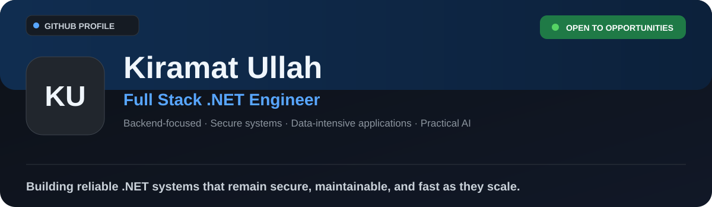
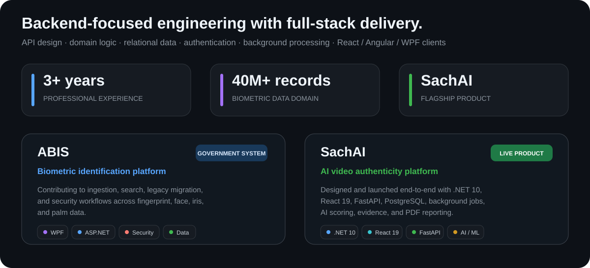
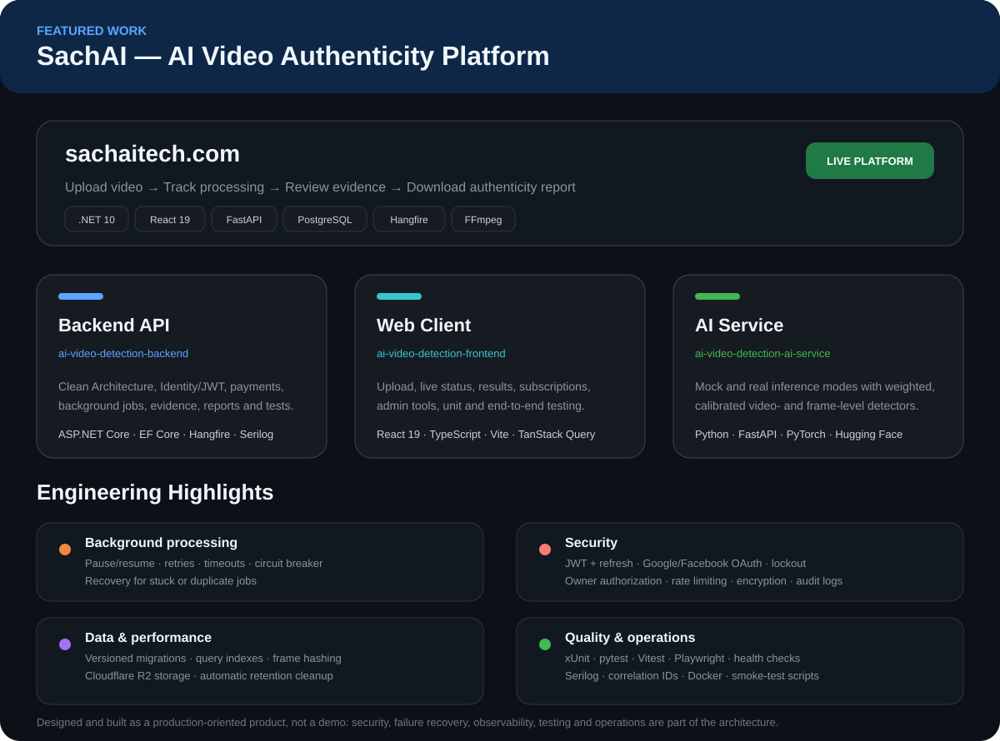
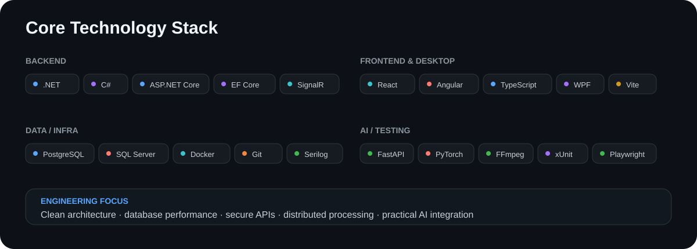
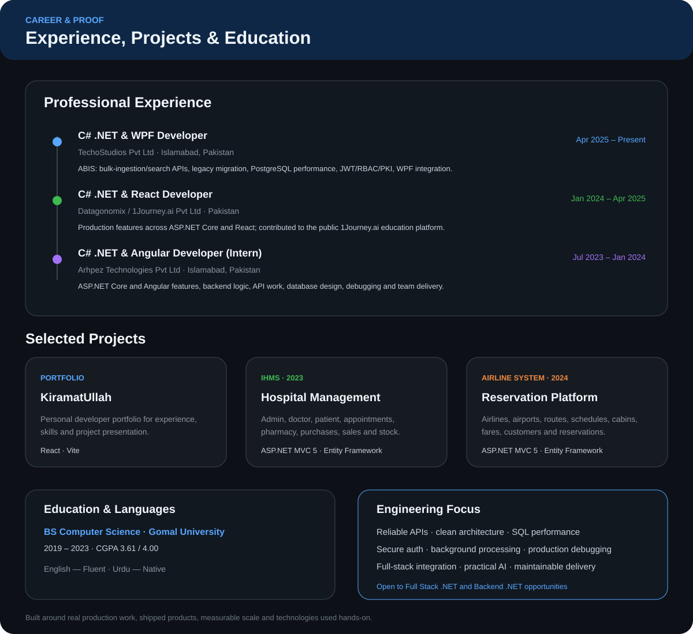

  

  
  
  

## About

I am a **backend-focused Full Stack .NET Engineer** with **3+ years of experience** building secure, data-intensive applications across APIs, relational data, background processing, authentication and authorization, and React, Angular, and WPF clients.

  

---

## Featured Project — SachAI

  

### Repositories

- [**ai-video-detection-backend**](https://github.com/KiramatUllah171/ai-video-detection-backend) — .NET 10 / ASP.NET Core backend with Clean Architecture, Hangfire processing, FFmpeg extraction, AI scoring, evidence generation, PDF reports, authentication, subscriptions, payments, observability, and automated tests.
- [**ai-video-detection-frontend**](https://github.com/KiramatUllah171/ai-video-detection-frontend) — React 19 / TypeScript client for uploads, live processing status, results, subscriptions, and admin workflows.
- [**ai-video-detection-ai-service**](https://github.com/KiramatUllah171/ai-video-detection-ai-service) — Python / FastAPI inference service using weighted video- and frame-level AI models.

  
  
  
  
  
  
  

---

## Tech Stack

  

---

## Experience & Selected Projects

  

### Project Links

- [**Portfolio — KiramatUllah**](https://github.com/KiramatUllah171/KiramatUllah) · [Live site](https://kiramat-ullah.vercel.app/)
- [**IHMS**](https://github.com/KiramatUllah171/IHMS)
- [**Airline Management System**](https://github.com/KiramatUllah171/Airline_Management_System)

---

## GitHub Overview

  
  

---

## Let's Connect

Open to **Full Stack .NET** and **Backend .NET** opportunities, plus collaboration on secure APIs, scalable backend systems, data-intensive applications, and practical AI products.

  
  
  

